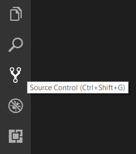
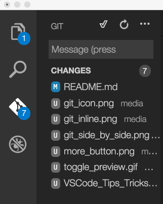

# Lesson 2: Create a New React Project

## Setup

Register for a free account on GitHub:
https://github.com/join

Then click on the `+` icon at the top right of the page, and click on `New repository`. For `Repository name`, use `website`. Don't modify the other fields, and click the `Create repository` button. Click the `Edit` button, enter `https://myusername.github.io/website/` into the `Website` field (replacing `myusername` with your GitHub username), and click the `Save` button.

Configure Git by running this in Terminal or Hyper, replacing the name and email address with your name and email address:

```sh
git config --global user.name "Mijeong Han"
git config --global user.email "email@address.com"
```

Create a new React project, replacing `myusername` with your GitHub username:

```sh
cd ~/Projects
npx create-react-app website
cd website
git init
git add .
git commit -m "Initial commit"
git remote add origin git@github.com:myusername/website.git
git push --set-upstream origin master
```

Open Visual Studio Code (VSCode), do `File -> Add Folder to Workspace`, and choose the `Projects/website` folder.

Open the `.gitignore` file (use <kbd>Command+P</kbd> to find it quickly) and add this line to the end of the file:

```
.vscode
```

Open your `package.json` file and add a `homepage` field for your project underneath the `"private": true` line, replacing `myusername` with your GitHub username:

```
  "private": true,
  "homepage": "https://myusername.github.io/website/",
```

Also in `package.json`, add the following `predeploy` and `deploy` lines just after the `scripts` line:

```
  "scripts": {
    "predeploy": "npm run build",
    "deploy": "gh-pages -d build",
```

Add the `gh-pages` module so that we can publish your website to GitHub:

```sh
yarn add -D gh-pages
```

Click on the Source Control icon in VSCode. If the pane closes, then click the icon again to open it.



In the `WEBSITE - Git` area of VSCode, hover on the `Changes` line and then click on the `+` icon, as shown in this picture:



Find the `Message` input area. Type `Configure gh-pages` into it. This is a commit message that describes what you did. Type <kbd>Command+Enter</kbd> to commit the change.

Go back to the terminal and run this to upload your website to GitHub:

```sh
git push
yarn run deploy
```

Open https://myusername.github.io/website/ in Chrome, replacing `myusername`. You should see an example `Welcome to React` website.

Now let's make the deployment happen automatically whenever we run `git push`. To do this, install `husky`:

```sh
yarn add -D husky@next
```

Edit `package.json` and add the following lines after the `homepage` line:

```
  "husky": {
    "hooks": {
      "pre-push": "npm run deploy"
    }
  },
```

Now commit the changes using VSCode using the commit message `Configure husky`, and then run this in the Terminal:

```sh
git push
```

## Explanation

### npx command

The `npx` command is used to execute an npm module. A list of npm modules can be found at https://www.npmjs.com/ . If you include commandline arguments, those are passed into the module. If you are inside of a working directory which has a `package.json` file, the version in that file will be used to run the command. If you are running something which is not in `package.json` (or you are outside of a working directory), `npx` will run the latest version of that module.

### package.json file

The `package.json` file tells other people the name of your project, who wrote it, what its dependencies are, and sometimes other configuration settings. Dependencies are npm modules that are installed alongside your project, and which your project needs.

The `devDependencies` field is for npm modules that are used only to build your project and not to run it. The `dependencies` field is for npm modules that your code directly imports and relies on.

You might notice that dependencies include a version number, for example:

```
"react": "^16.4.0",
```

The `^` sign in front of the version means: if a newer version like "16.4.1" or "16.5.0" is released, use that instead of version "16.4.0". Versions like "17.0.1" are not installed.

### yarn command

The `yarn` command is used to install and remove packages. It creates a file called `yarn.lock` which we never edit directly. This file tracks the exact version of each dependency that you've installed in `package.json`. You might remember that `package.json` uses version **patterns** like "^16.4.0". Instead of recording only that pattern, Yarn also writes the exact version of the npm module which matched that pattern, like "16.4.1".

When someone else uses `yarn install` after downloading your repo, Yarn will prefer to install the exact versions of npm modules from `yarn.lock`, so that you and she have exactly the same code. This makes your project much safer to use, and avoids surprises.

When we use `yarn add an-npm-module`, then we add the npm module named `an-npm-module` as a `dependencies` to `package.json`. The dependency will also be installed into the `node-modules` folder so that our code can use it. If we use `yarn add -D an-npm-module`, then we save it into the `devDependencies` area of `package.json` instead of `dependencies`. In both cases, Yarn will find the latest version of the dependency and use that. If you instead write: `yarn add an-npm-module@^1.0.0`, then Yarn will include the latest version which matches that pattern, which is useful for including old modules or beta modules that are not completely done yet.

### npm command

The `npm` command acts similar to the `yarn` command. We use it only in the `package.json` `scripts` area. The reason for that is: not every Javascript developer will have `yarn` installed, but all of them have `npm` installed. `npm` is also capable of adding and removing dependencies, but we prefer to use `yarn` for that instead, since `yarn` also records an exact version into `yarn.lock`.

### package.json scripts

If the `package.json` file has a `scripts` area, each entry defines a command that can be executed with `yarn run`. The left side is the name and the right side is the command. In the following example, we can execute the script using `yarn run deploy`.

```
    "deploy": "gh-pages -d build",
```

If the right side begins with the name of an npm dependency, then that dependency is executed. Otherwise it will try to find the command on your system, like this:

```
    "predeploy": "npm run build",
```

If the script name begins with `pre`, like `predeploy`, then it has special meaning. When you call a script like `deploy`, the `predeploy` script is automatically run first, ahead of `deploy`. If no `predeploy` script exists, we only run the `deploy` script.

Some other script names have special meaning to `npm` and `yarn`, like `build`, `test`, and `publish`.

### git command

Git is used to create "save points" for your work. When you are happy with how the code looks after making a change, you will "commit" the change using `git commit`, which creates a save point (we call these "commits"). Then when you make more changes, you can see the difference from the previous commit, which helps review your work.

Git allows you to choose which files are included in the commit, since maybe you have some changes to other files that aren't ready to save yet. To include a file in the next commit, we "stage" the file by running `git add` on it, or by clicking the `+` sign next to the file in VSCode. Whenever we create a new file, we also need to call `git add` on it, so that Git knows that it should be included in the next commit.

The `git clone` command is used to download a git project (or "repository", or "repo") from GitHub and save it into a directory. When a project is cloned, we say that it has a "remote" named "origin", which is set to the URL of the place we cloned it from. Since we are creating a new project, we don't use `git clone`, and instead use `git remote add` to tell git where the source code should be uploaded. Then we do the upload by calling `git push`.

The default branch that we get when we create a new project or clone an existing project is named "master".

### src/index.js file

The very first file that React sees when it builds or runs a project is `src/index.js`. This file is Javascript, but can also have JSX code in it.

### import statements

Most Javascript code uses `import` to bring in a dependency. Dependencies can be either local files or npm modules.

This is a local file, which is stored into a constant variable named `App`. We know that it is local because the path on the right begins with ".".

```js
import App from './App';
```

This is an npm module. We know that it's an npm module because it does not start with ".".

```js
import React from 'react';
```

It's also possible to import only a few parts of a dependency. In this case, we create two constant variables `CookieNames` and `CookieOptions`.

```js
import { CookieNames, CookieOptions } from '../models/enums';
```

### export statements

If you look in `App.js`, you can see that it has a like like this:

```js
export default App;
```

This means that if you have an `import` statement in a different file, that file will receive the contents of the `App` class or variable.

It's also possible to provide single parts, which other files can bring in with an `import { CookieNames, CookieOptions }` statement.

```js
export { CookieNames, CookieOptions };
```
