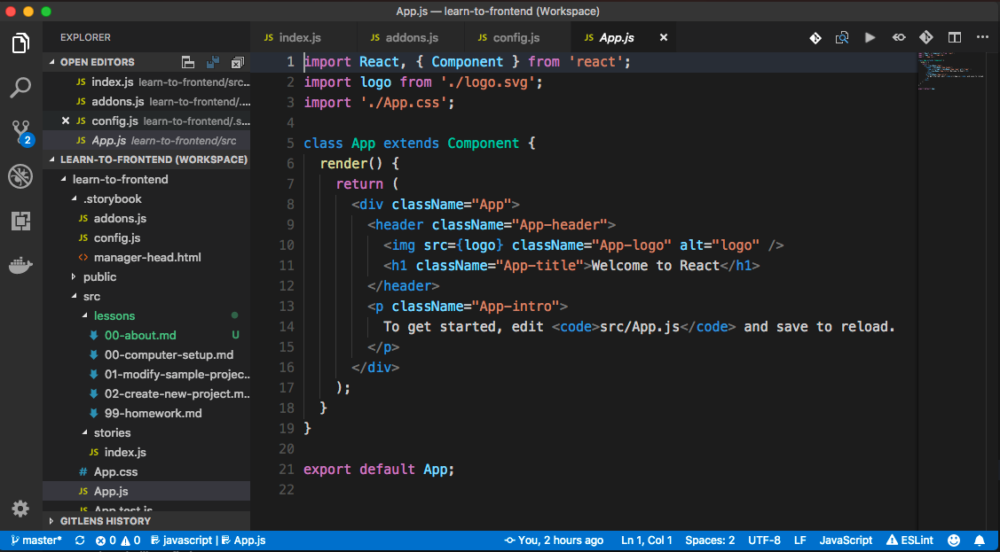

# About These Lessons

This website is designed to teach Frontend Programming skills. We will cover:

* How to set up your computer with a code editor
* How to use common command line tools
* How to modify an existing frontend project
* How to build your own website
* Explanations for different concepts and terms

There are homework assignments to encourage further self-study.

